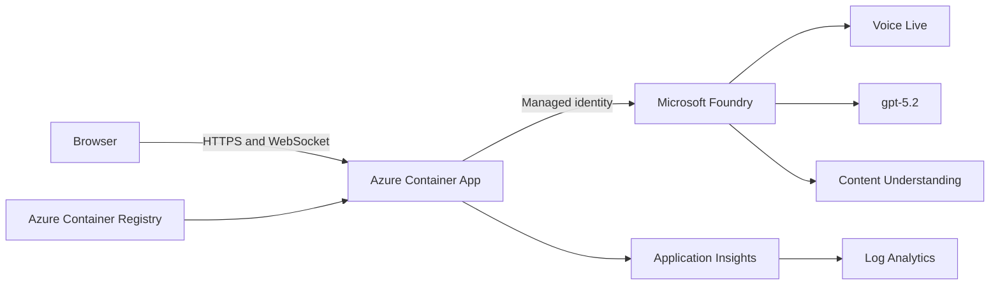

# Azure Deployment Plan

Status: Validated

## 1. Goal

Deploy the Azure-integrated Bank Alfa mortgage demo to Azure Container Apps in Sweden Central using the existing subscription-scope Bicep infrastructure and Azure CLI. Preserve one replica because application state is process-local.

## 2. Application

- Project: `voice-mortgage-application`
- Runtime: Python 3.12, FastAPI, Uvicorn
- Frontend: React 19, TypeScript, Vite, built into the container image
- Container: multi-stage `Dockerfile`, listening on port 8000
- State: dummy in-memory banking case, one Container App replica
- AI: Azure Voice Live, Azure OpenAI `gpt-5.2`, Azure Content Understanding `mortgage_payslip`
- Authentication: user-assigned managed identity and Microsoft Entra ID; no API keys

## 3. Target Architecture

Existing `foundry-mortgage` and project `proj-default` are referenced, not recreated. Bicep provisions the resource group support resources, ACR, Container Apps environment and app, managed identity, Key Vault, telemetry, and least-privilege role assignments.

## 4. Deployment Recipe

- Type: Azure CLI with Bicep and Azure Container Registry build
- Subscription: `ac021984-29ca-42e6-9c21-36e599814543`
- Tenant: `cc48e4fe-6662-414d-aeff-4eb633735b38`
- Location: `swedencentral`
- Resource group: `rg-voice-mortgage-app`
- Bicep entry point: `infra/main.bicep`
- Parameters: `infra/main.parameters.json`
- Registry: `crbankalfadev39c7`
- Image: `crbankalfadev39c7.azurecr.io/voice-mortgage:<immutable-tag>`
- Container App: `ca-bank-alfa-dev-39c7`

Execution is two phase:

1. Deploy Bicep with the public placeholder image so ACR and managed identity exist.
2. Verify `AcrPull`, Foundry User, and Cognitive Services User assignments.
3. Build and push the immutable application image with ACR Tasks.
4. Redeploy Bicep with the immutable ACR image.
5. Verify health, readiness, customer UI, document analysis, structured model routing, and Voice Live WebSocket.

## 5. Security And Configuration

- `disableLocalAuth` remains enabled on Foundry.
- Container App uses `AZURE_CLIENT_ID` for the user-assigned managed identity.
- Non-secret endpoints and model deployment names are injected as environment variables.
- No credentials or API keys are embedded in the image or Bicep.
- Dummy customer data only; no real banking backend or customer data.
- Consent, policy enforcement, and mortgage arithmetic remain deterministic server-side controls.

## 6. Expected Changes

The latest what-if must contain no deletes. Existing Foundry resources are referenced. New support resources and the Container App are created or updated only within `rg-voice-mortgage-app`.

## 7. Validation Proof

All validation checks pass:

- [x] Core Bicep validation: official `validate-deployment.ps1` returned `OVERALL: PASS` for CLI, tenant authentication, build, subscription validation, and what-if.
- [x] Machine-readable what-if: 8 Create, 1 Modify, 2 Ignore, 4 Unsupported, and 0 resource Deletes.
- [x] Bicep linting: passed with non-blocking BCP081 type-metadata warnings for preview API versions.
- [x] Azure Policy check: three subscription security assignments use default enforcement; no resource-group assignment or explicit deny affects Container Apps, ACR, managed identity, Key Vault, Log Analytics, or Application Insights.
- [x] Python dependencies and tests: `pip check` passed; `pytest -q` passed 10 tests.
- [x] React tests and production build: Vitest passed 3 tests; TypeScript and Vite production build passed.
- [x] Static managed-identity role verification: `AcrPull` is scoped to ACR; `Cognitive Services User` and `Azure AI User` are scoped to Foundry; `Key Vault Secrets User` is scoped to Key Vault. The deployer has resource-scoped `Key Vault Secrets Officer`.
- [x] Live Azure Content Understanding analysis: a generated fictional PNG was uploaded through the API; `mortgage_payslip` extracted five grounded fields, accepted automatically, with confidence 0.856-0.983.
- [x] Live Azure OpenAI structured intent routing: `gpt-5.2` classified a natural-language mortgage request and the controlled dispatcher requested explicit `credit_check` consent.
- [x] Live Azure Voice Live structured tool-to-speech turn: `gpt-realtime-1.5` reached listening/speaking, invoked `process_customer_request`, returned the exact controlled identity-gate reply, and streamed 360,000 PCM bytes with no service error.

## Role Assignment Verification

- Status: Verified
- Identity checked: `id-bank-alfa-dev-39c7`
- Roles confirmed: `AcrPull`, `Cognitive Services User`, `Azure AI User`, and `Key Vault Secrets User`
- Scopes: Individual ACR, Foundry account, and Key Vault resources
- Issues: None

## 8. Rollback

Container Apps revisions permit rollback to the previous immutable image. Infrastructure rollback uses the preceding Bicep parameters and image tag. No resource-group deletion is part of this plan.
