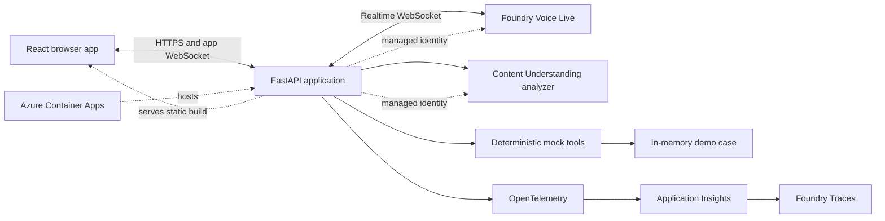
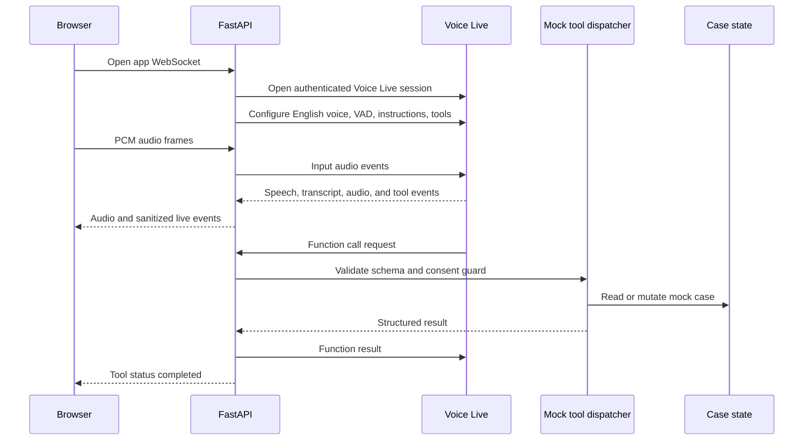
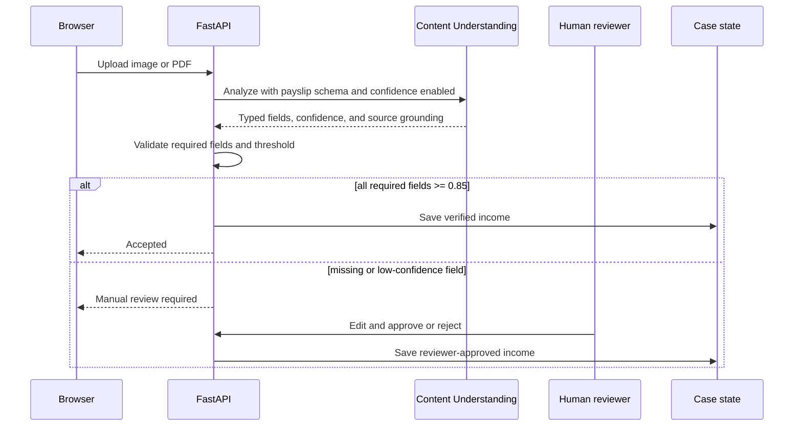

# Architecture and Integrations

## Architecture goals

- Stay close to the reference application's Python/FastAPI, explicit-tool, realtime-event, and in-memory-state patterns.
- Support browser audio from an Azure-hosted application.
- Keep the demo in one deployable Container App.
- Use Microsoft Foundry for all AI capabilities.
- Keep mock banking behavior deterministic and testable.
- Separate audience-safe live activity from deeper platform telemetry.

## Logical architecture

## Deployment shape

One Azure Container App hosts one container image:

- FastAPI is the single server process.
- FastAPI serves the compiled React static assets.
- REST endpoints handle upload, case state, review actions, reset, and health.
- One application WebSocket handles browser audio, transcript events, connection state, consent events, and tool activity.
- FastAPI opens a server-side Voice Live connection using managed identity. Foundry credentials and access tokens are never sent to the browser.

Azure Container Apps HTTP ingress supports TLS termination and WebSockets. Set a minimum replica count of one for presentation reliability. Because case state is process-local, the demo must use one active replica and no scale-out. A later production design would externalize session state.

## Realtime voice flow

The implementation may use the current Voice Live browser-oriented WebRTC option if a short technical spike proves it simpler and equally secure. The behavioral contract remains: browser microphone, low latency, tool calls on the trusted server, no service credential in the browser, and observable barge-in. The default plan uses an application WebSocket proxy because it mirrors the reference backend-controlled session and tool registry.

## Barge-in contract

Barge-in is not an SDK-default assumption. It is an end-to-end behavior:

1. Voice activity begins while agent audio is playing.
2. Browser playback is stopped and queued audio is cleared.
3. The active Voice Live response is cancelled or truncated according to the current API contract.
4. An `interruption.detected` event is emitted to the UI.
5. New user audio is processed as the next turn without losing accepted case data or consent history.

The Voice Live session's VAD/interruption configuration and manual cancellation logic must agree. The implementation must not repeat the reference repository's contradictory combination of `interrupt_response=False` and manual cancellation without a verified reason.

## Document flow

The custom Content Understanding schema uses direct extraction for employer, gross salary, net salary, employment type, and pay date. Confidence and source grounding must be enabled. Normalized values are retained alongside display values and provenance.

## Foundry boundary

| Capability | Service or component | Real or mock |
|---|---|---|
| Document extraction | Azure Content Understanding in Foundry Tools | Real |
| Speech-to-speech session | Voice Live on a Foundry resource | Real |
| Realtime model and function selection | Voice Live model session | Real |
| Tool execution | FastAPI tool dispatcher | Deterministic mock |
| CRM, credit, policy, calendar, cards | In-memory adapters | Mock |
| AI tracing | OpenTelemetry to Application Insights and Foundry Traces | Real |
| Customer-facing activity panel | Sanitized application events | Real app telemetry |
| Identity approval | DigitalD modal and mock tool | Mock |

The Voice Live session is the single agent for this demo. Specialist Foundry agents are not required. This avoids duplicate orchestration layers and keeps realtime latency and tool ordering understandable.

## Event and observability model

Every operation receives a session ID, case ID, correlation ID, timestamp, and sequence number. The browser sees only a sanitized event projection.

Event families:

- `session.*`: connecting, ready, stopped, failed
- `audio.*`: user speaking, assistant speaking, interruption detected
- `transcript.*`: final user and assistant text
- `document.*`: uploaded, analyzing, extracted, review required, approved, rejected
- `consent.*`: requested, granted, denied, consumed
- `tool.*`: queued, running, completed, failed, blocked by policy
- `case.*`: income saved, summary updated, reset
- `handoff.*`: document reviewer required, advisor final decision required

The visible panel shows tool name and status, plus concise consent and handoff events. It does not expose chain-of-thought, credentials, full documents, or sensitive raw payloads.

OpenTelemetry spans should cover document analysis, Voice Live session lifecycle, model responses where supported, and each tool invocation. Application Insights is connected to the existing Foundry project so traces can be viewed in Foundry. Content recording should be disabled by default even though data is fictional; enable it only as an explicit demo configuration.

## Identity and secrets

- Azure Container App uses a managed identity.
- Grant only the roles required to call the existing Foundry resource and emit telemetry.
- Use `DefaultAzureCredential` in deployed code and developer credentials locally.
- Keep endpoints and non-secret deployment names in configuration.
- Keep any unavoidable secrets in Container Apps secrets or Key Vault references, never in source or browser bundles.
- DigitalD is not Azure authentication. It is a fictional business-flow mock.
- The demo URL has no app login by product decision; deployment documentation must call out that public exposure is acceptable only because all data is fake.

## State and concurrency

State is an in-memory `DemoCase` keyed by the current demo session. It contains document results, accepted income, identification state, CRM profile, consent records, calculation inputs/results, meeting, cards, advisor summary, and ordered events.

For the initial demo:

- one active demo session at a time
- one Container App replica
- reset restores the complete canonical state
- container restart loses all progress and returns to canonical state
- no database, cache, blob persistence, or customer PII

The implementation should isolate state behind a repository interface so persistence can be added later without changing tools.

## Reliability and fallback

- Text input can replace microphone input within the same active conversation.
- Voice WebSocket reconnect is visible and does not claim an action succeeded unless its tool completed.
- Tool functions are idempotent where practical; repeated booking or card-block calls return the existing result.
- Reset closes active voice sessions before restoring state.
- A health endpoint checks application readiness and configuration presence but does not leak endpoints or credentials.
- Curated high- and low-confidence payslips make both document paths repeatable.

## Reference differences to preserve

The reference repository uses FastAPI, Streamlit, SSE, PyAudio, an event-bus singleton, in-memory account state, and direct Voice Live function tools. This design keeps FastAPI, explicit tools, event-driven UI updates, and resettable memory state. It changes the UI and transport because a hosted browser cannot use the Container App's microphone. It also treats tool lifecycle events as first-class instead of inferring them only from domain mutations.

## Official references

- [Voice Live API overview](https://learn.microsoft.com/azure/ai-services/speech-service/voice-live)
- [How to use Voice Live](https://learn.microsoft.com/azure/ai-services/speech-service/voice-live-how-to)
- [Voice Live with WebRTC](https://learn.microsoft.com/azure/ai-services/speech-service/voice-live-webrtc)
- [Content Understanding document solutions](https://learn.microsoft.com/azure/ai-services/content-understanding/document/overview)
- [Set up tracing in Microsoft Foundry](https://learn.microsoft.com/azure/foundry/observability/how-to/trace-agent-setup)
- [Azure Container Apps ingress and WebSocket support](https://learn.microsoft.com/azure/container-apps/ingress-overview)
